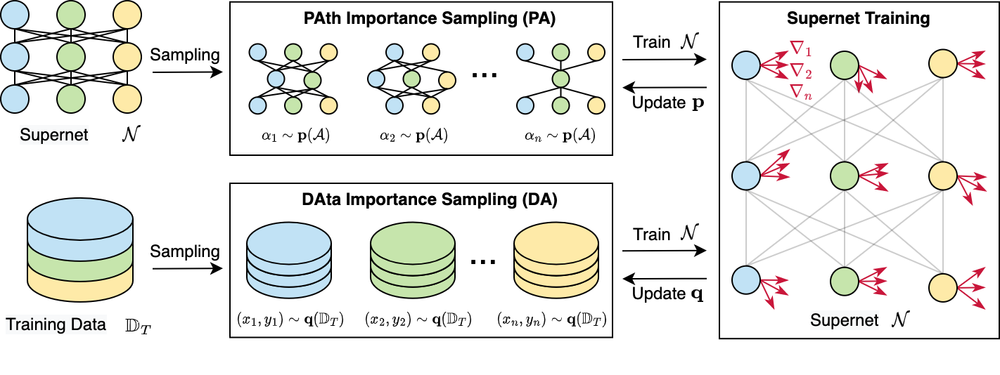

# PA&DA: Jointly Sampling PAth and DAta for Consistent NAS (CVPR 2023)


This repository contains the code for our paper "PA&DA: Jointly Sampling PAth and DAta for Consistent NAS", where we propose to explicitly minimize the gradient variance of the supernet training by jointly optimizing the sampling distributions of PAth and DAta (PA&DA).



## Prerequisites and Dependencies
To run our code, please see the prerequisites below:
1. Download the datasets of NAS-Bench-201 and NAS-Bench-1Shot1, and pre-trained checkpoints from the [[Google Drive](https://drive.google.com/drive/folders/1N0F1usOr0YVn9xLHU0RHDoGAHFScwt8l?usp=sharing)].
2. Install the necessary packages below. We adopt Python 3.7 in our experiments.

* use Anaconda to install PyTorch:
```shell
    # CUDA 10.2
    conda install pytorch==1.7.1 torchvision==0.8.2 torchaudio==0.7.2 cudatoolkit=10.2 -c pytorch
```

* use pip to install the following packages:
```shell
    pip install numpy==1.21.2 opencv-python==4.6.0.66 pandas==1.3.5 Pillow==9.0.1 pynvml==11.4.1 PyYAML==6.0 schema==0.7.5 scikit-image==0.19.3 scikit-learn==1.0.2 scipy==1.7.3 seaborn==0.12.2 six==1.16.0 tensorboard==1.15.0 thop==0.0.31 timm==0.6.11
```

## NAS-Bench-201 Experiments
We first construct the supernet of NAS-Bench-201 based on the [Awesome AutoDL](https://github.com/D-X-Y/Awesome-AutoDL). 
According to previous papers, we then provide our implementations for baseline methods such as [SPOS](https://link.springer.com/chapter/10.1007/978-3-030-58517-4_32), [FairNAS](https://openaccess.thecvf.com/content/ICCV2021/html/Chu_FairNAS_Rethinking_Evaluation_Fairness_of_Weight_Sharing_Neural_Architecture_Search_ICCV_2021_paper.html), and [SUMNAS](https://openreview.net/forum?id=Z8FzvVU6_Kj). 
The implementation of PA&DA are provided subsequently and adopts the same training configuration as baseline methods. 
If you have any questions or concerns, please feel free to raise an issue and discuss with us.

* Go to the folder of `nasbench201`:
```shell
    cd nasbench201
```
* Link your CIFAR-10 dataset to the folder of `./dataset/cifar10`:
```shell
    mkdir dataset
    ln -s /Path/To/Your/$Dataset ./dataset/cifar10
```
* Download `nasbench201_dict.npy` from [Google Drive](https://drive.google.com/drive/folders/1N0F1usOr0YVn9xLHU0RHDoGAHFScwt8l?usp=sharing)] and place it to the folder of `./dataset/nasbench201`:
```shell
    mkdir dataset/nasbench201
    mv /Path/To/nasbench201_dict.npy ./dataset/nasbench201
```
* Check and create the necessary folders:
```shell
    python check_folders.py
```
* Train and evaluate baseline methods:
```shell
    python train_baselines_201.py --method ${Baseline_Method}
```
where `${Baseline_Method}` can be either `spos`, `fairnas`, or `sumnas`. Note that this command will use the selected method to train the supernet and rank all sub-models after training. Results will be recorded to the `results` folder. We also provide the script to run experiments with different seeds in parallel:
```shell
    # set the Method and GPU IDX in the script
    bash script/train_baselines_201.sh
```
* Train and evaluate our PA&DA:
```shell
    python train_panda_201.py
```
Note that this command will use `PA&DA` to train the supernet and rank all sub-models after training. Results will be recorded to the `results` folder. We also provide the script to run experiments with different seeds in parallel:
```shell
    # set GPU IDX in the script
    bash script/train_panda_201.sh
```
## Citation
If you find this work helpful in your research, please consider citing our paper:
```
@inproceedings{lu2023pa-da,
  title     = {PA&DA: Jointly Sampling PAth and DAta for Consistent NAS},
  author    = {Lu, Shun and Hu, Yu and Yang, Longxing and Sun, Zihao and Mei, Jilin and Tan, Jianchao and Song, Chengru},
  booktitle = {Proceedings of the IEEE/CVF Conference on Computer Vision and Pattern Recognition (CVPR)},
  year      = {2023}
}
```
